# Pentasec

Pentest reporting made effortless. Pentasec is an open-source penetration testing reporting and evidence management tool that helps security professionals generate professional vulnerability reports with AI assistance.

## What's New

See [CHANGELOG.md](CHANGELOG.md) for the latest updates and release notes.

## Overview

Pentasec consists of two applications:

- **Web App** -- A Next.js marketing site with user authentication, documentation, and account management.
- **Desktop App** -- An Electron + Next.js application with a Python (Flask) backend for managing pentest projects, collecting evidence, and generating reports.

### Key Features

- **AI-Powered Report Generation** -- Automatically generate detailed vulnerability reports using Google Gemini.
- **Evidence Vault** -- Organize and manage screenshots, logs, and other pentest evidence.
- **AI Redaction** -- Automatically detect and redact sensitive information from reports and images.
- **Project Management** -- Create and track penetration testing engagements.
- **PDF Export** -- Generate professional PDF reports from your findings.
- **Report Archive** -- Store and browse historical reports.
- **Local Encryption** -- AES-256-GCM encryption for all sensitive local data.

## Screenshots

### Dashboard
The main dashboard provides an overview of all your pentest projects and recent activity.

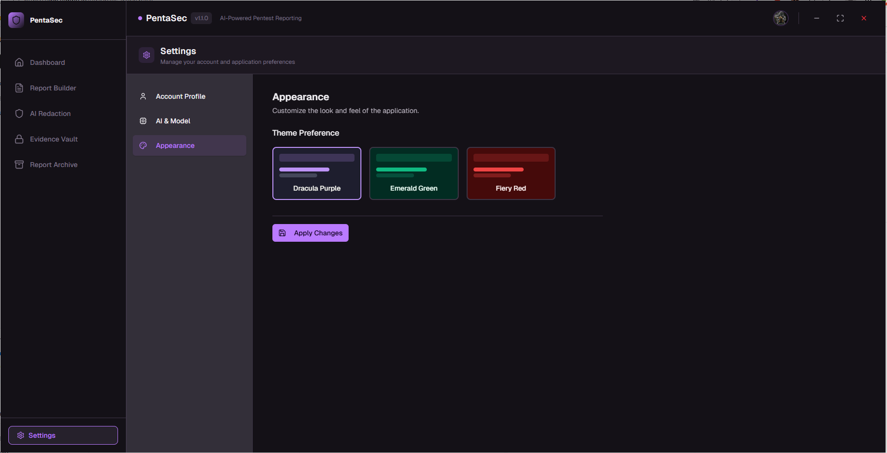

### Evidence Vault
Organize and manage all your pentest evidence including screenshots, logs, and findings in one secure location.

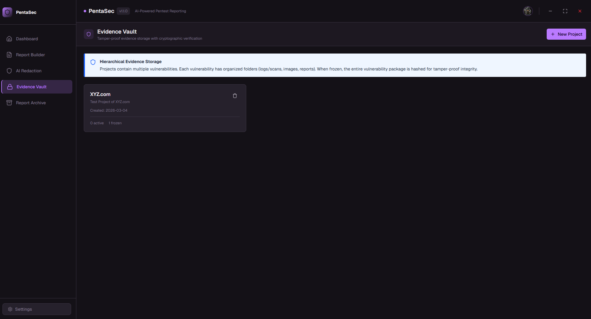
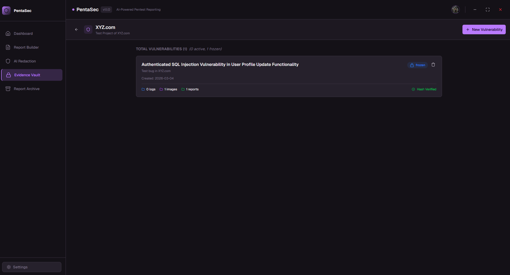
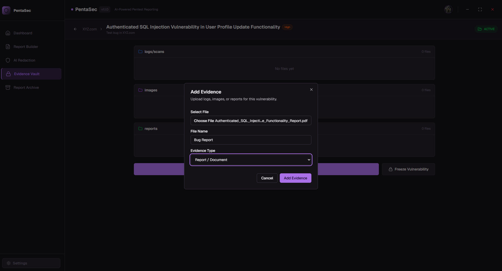
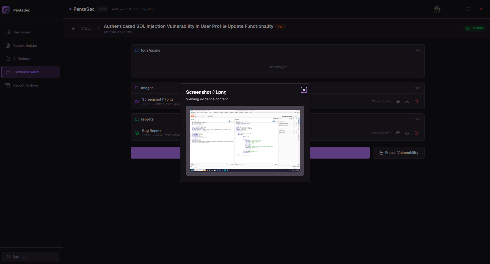
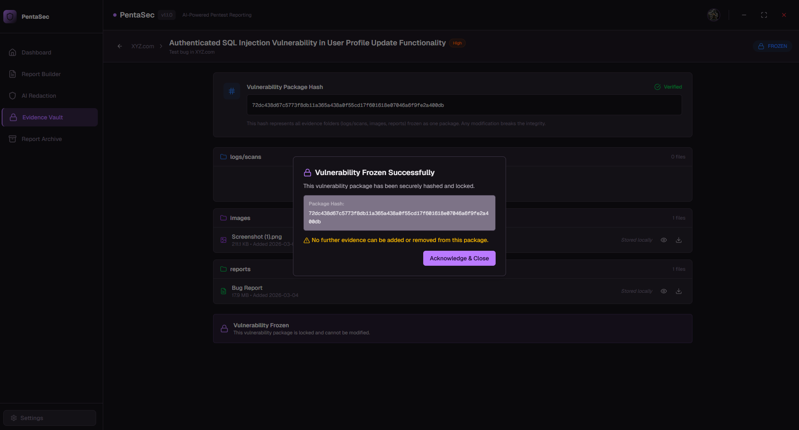
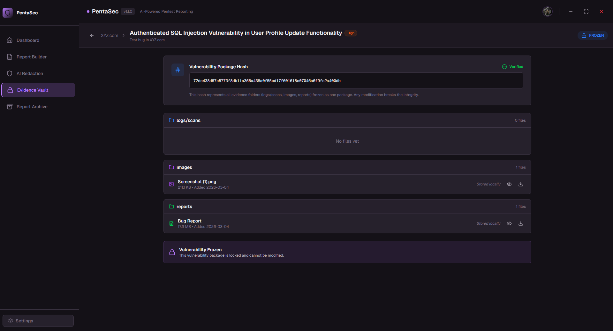

### AI-Powered Report Generation
Leverage Google Gemini AI to automatically generate detailed, professional vulnerability reports from your findings.

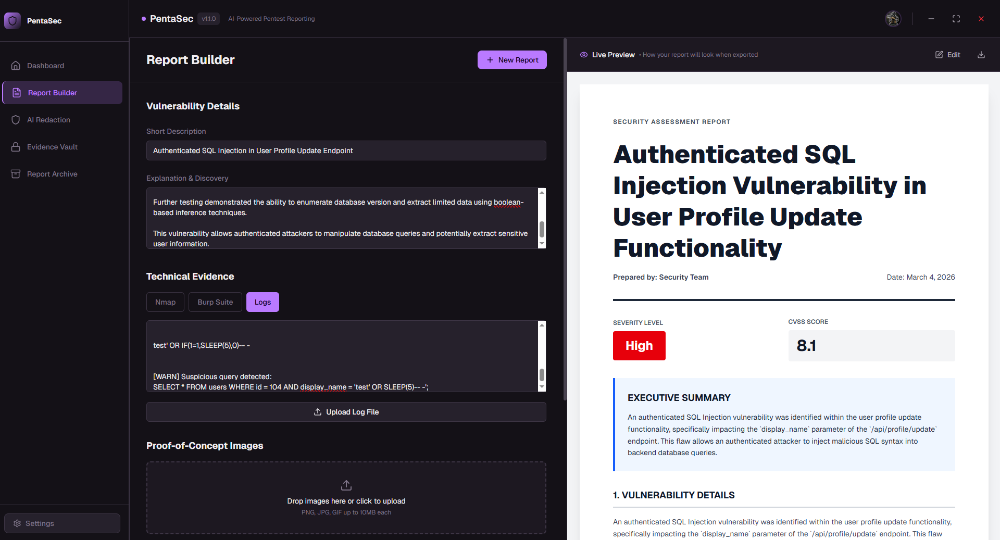
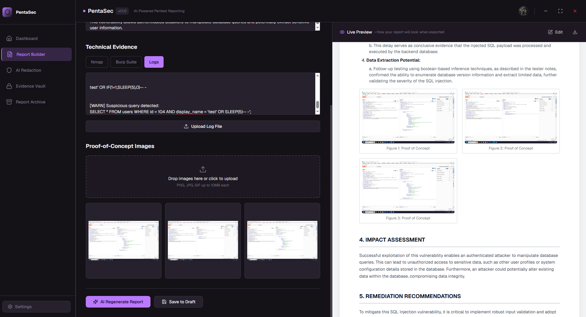

### AI Redaction
Automatically detect and redact sensitive information like credentials, PII, and confidential data from your reports and screenshots.

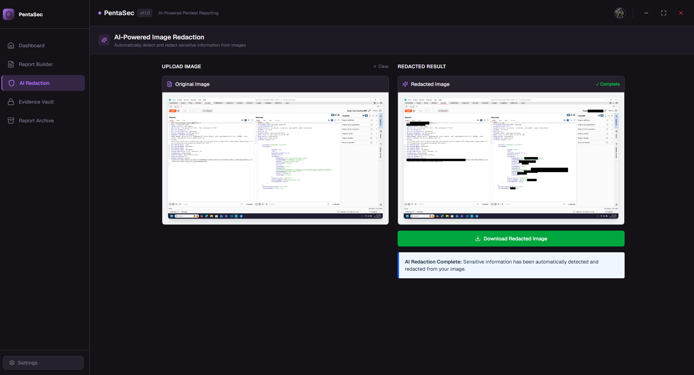

### Report Archive
Store and browse historical reports with easy access to past pentest engagements.

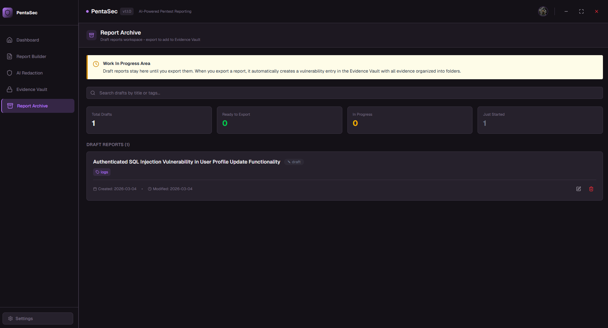

## Tech Stack

| Layer | Technology |
|-------|------------|
| Frontend | React 19, Next.js 16, TypeScript, Tailwind CSS 4 |
| Desktop | Electron 40 |
| Backend | Python, Flask |
| Database | MongoDB (web), encrypted JSON (desktop) |
| AI | Google Generative AI (Gemini) |
| Auth | NextAuth.js (web), JWT (desktop) |
| UI | Radix UI, shadcn/ui |

## Prerequisites

- [Node.js](https://nodejs.org/) >= 18
- [Python](https://www.python.org/) >= 3.9
- [MongoDB](https://www.mongodb.com/) (for the web app)
- [Tesseract OCR](https://github.com/tesseract-ocr/tesseract) (for AI redaction features)
- A [Google Gemini API key](https://aistudio.google.com/apikey) (for AI report generation)

## Getting Started

### Web App

```bash
cd web
npm install
cp .env.example .env
# Edit .env with your MongoDB URI and NextAuth settings
npm run dev
```

The web app will be available at `http://localhost:3000`.

### Desktop App

1. Install frontend dependencies:

```bash
cd desktop
npm install
```

2. Install Python backend dependencies:

```bash
cd desktop/backend
pip install -r requirements.txt
cp .env.example .env
# Edit .env with your configuration
```

3. Run in development mode:

```bash
cd desktop
npm run electron:dev
```

Or run the backend separately:

```bash
cd desktop/backend
python app.py --no-electron
```

### Building the Desktop App

```bash
cd desktop
npm run dist
```

This produces platform-specific installers in the `release/` directory.

## Project Structure

```
pentasec/
├── web/                          # Next.js web application
│   ├── src/
│   │   ├── app/                  # App router pages
│   │   │   ├── about/
│   │   │   ├── api/              # API routes
│   │   │   ├── contact/
│   │   │   ├── dashboard/
│   │   │   ├── docs/
│   │   │   ├── download/
│   │   │   ├── login/
│   │   │   ├── signup/
│   │   │   ├── layout.tsx
│   │   │   ├── page.tsx
│   │   │   └── globals.css
│   │   ├── components/           # React components
│   │   │   ├── ui/               # shadcn/ui components
│   │   │   ├── ai-demo.tsx
│   │   │   ├── before-after-slider.tsx
│   │   │   ├── docs-sidebar.tsx
│   │   │   ├── faq.tsx
│   │   │   ├── features.tsx
│   │   │   ├── footer.tsx
│   │   │   ├── hero.tsx
│   │   │   ├── navbar.tsx
│   │   │   ├── security.tsx
│   │   │   ├── testimonials.tsx
│   │   │   ├── workflow.tsx
│   │   │   └── ...
│   │   ├── hooks/                # Custom hooks
│   │   │   └── use-unicorn-studio.ts
│   │   ├── lib/                  # Utilities
│   │   │   ├── mongodb.ts
│   │   │   └── utils.ts
│   │   └── types/                # TypeScript type definitions
│   │       └── next-auth.d.ts
│   ├── public/                   # Static assets
│   ├── .env.example
│   ├── next.config.ts
│   ├── package.json
│   └── tsconfig.json
│
├── desktop/                      # Electron desktop application
│   ├── app/                      # Next.js pages for Electron
│   │   ├── auth/
│   │   │   ├── callback/
│   │   │   └── signin/
│   │   ├── layout.tsx
│   │   ├── page.tsx
│   │   └── globals.css
│   ├── backend/                  # Python Flask backend
│   │   ├── routes/               # API route handlers
│   │   │   ├── ai_routes.py
│   │   │   ├── auth_routes.py
│   │   │   ├── project_routes.py
│   │   │   ├── report_routes.py
│   │   │   ├── settings_routes.py
│   │   │   └── status_routes.py
│   │   ├── app.py                # Flask entry point
│   │   ├── build.py              # Build script
│   │   ├── config.py             # Path configuration
│   │   ├── database.py           # Database operations
│   │   ├── encryption.py         # AES-256-GCM encryption
│   │   ├── security.py           # Security utilities
│   │   ├── tesseract_config.py   # OCR configuration
│   │   ├── utils.py              # AI integration & helpers
│   │   ├── version.py            # Version management
│   │   ├── requirements.txt
│   │   └── .env.example
│   ├── components/               # React components
│   │   ├── ui/                   # shadcn/ui components (50+)
│   │   ├── sidebar.tsx
│   │   ├── dashboard.tsx
│   │   ├── evidence-vault.tsx
│   │   ├── preview-panel.tsx
│   │   ├── settings-page.tsx
│   │   ├── report-archive.tsx
│   │   ├── ai-redaction.tsx
│   │   ├── header.tsx
│   │   ├── main-content.tsx
│   │   └── ...
│   ├── hooks/                    # Custom hooks
│   │   ├── use-mobile.ts
│   │   └── use-toast.ts
│   ├── lib/                      # Utilities
│   │   ├── api.ts
│   │   └── utils.ts
│   ├── styles/                   # Additional styles
│   ├── main.js                   # Electron main process
│   ├── preload.js                # Electron preload script
│   ├── electron.d.ts             # Electron types
│   ├── next.config.mjs
│   └── package.json
│
├── CONTRIBUTING.md
├── CODE_OF_CONDUCT.md
├── SECURITY.md
├── LICENSE
└── README.md
```

## Contributing

We welcome contributions! Please see [CONTRIBUTING.md](CONTRIBUTING.md) for guidelines on how to get involved.

## Security

If you discover a security vulnerability, please see [SECURITY.md](SECURITY.md) for responsible disclosure instructions. **Do not open a public issue for security vulnerabilities.**

## License

This project is licensed under the GNU General Public License v3.0 (GPLv3). See [LICENSE](LICENSE) for details.
